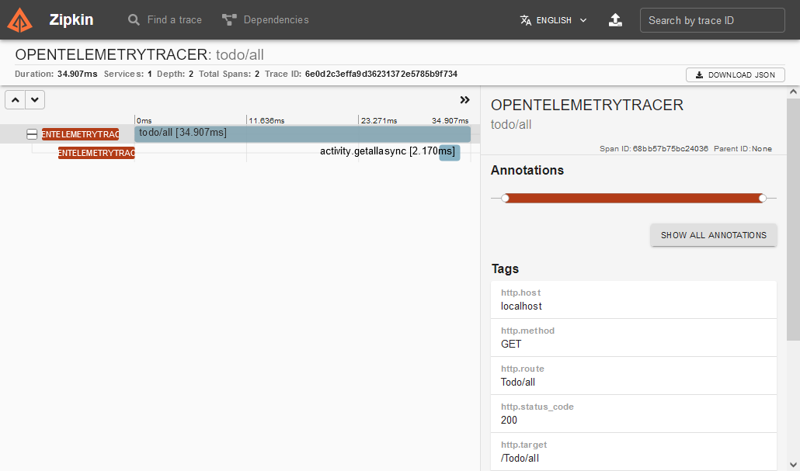

[](https://github.com/aimenux/OpenTelemetryWebApiDemo/actions/workflows/ci.yml)

# OpenTelemetryWebApiDemo
```
Using OpenTelemetry with webapi applications
```

In this demo, i m using [OpenTelemetry](https://devblogs.microsoft.com/dotnet/opentelemetry-net-reaches-v1-0/) in order to build instrumentation within a webapi application.
>
>
:rocket: To run code, follow these steps :
> 
> - Type `dotnet dev-certs https --clean` to clean local certificates
>
> - Type `dotnet dev-certs https --trust -ep $env:USERPROFILE\.aspnet\https\aspnetapp.pfx -p LOCALDEVPASS`
>
> - Type `docker-compose -f "docker-compose.debug.yml" up -d`
>
> - Open [zipkin url](http://localhost:9411/zipkin) and [swagger](https://localhost/swagger/index.html) in your browser
>
> - Type `docker compose down`

>
**`References`** :
>
> :zap: [Hosting ASP.NET Core images with Docker Compose over HTTPS](https://docs.microsoft.com/en-us/aspnet/core/security/docker-compose-https)
>
> :zap: [How to run ASP.NET Core 3.1 over HTTPS in Docker using Linux Containers](https://tomssl.com/how-to-run-asp-net-core-3-1-over-https-in-docker-using-linux-containers/)
>



**`Tools`** : vs22, net 6.0, ef, docker, opentelemetry, zipkin